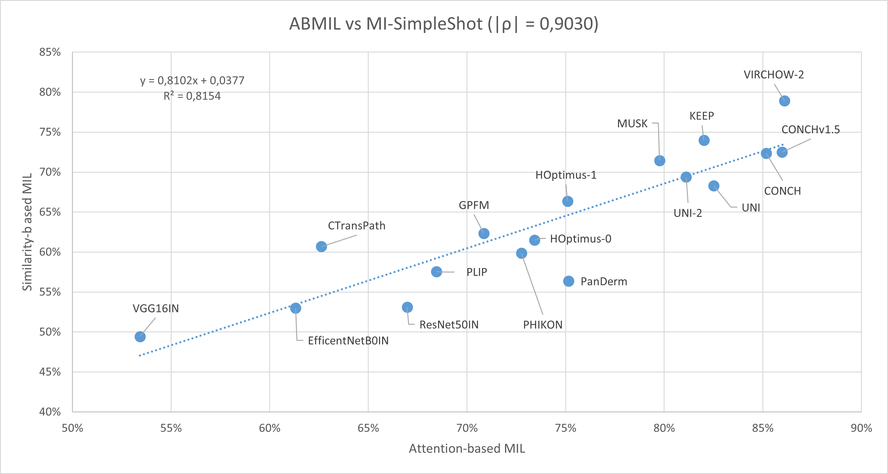
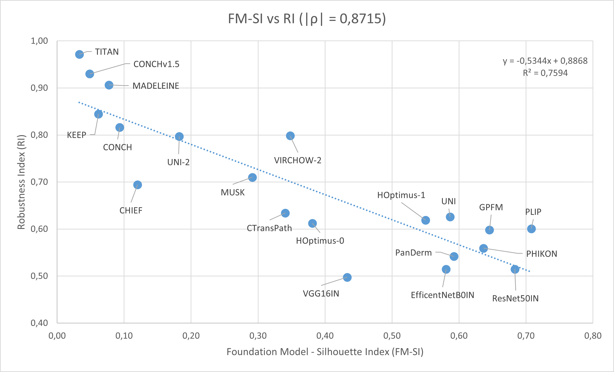

# AI4SKIN Leaderboard

**AI4SKIN Leaderboard**: [Benchmarking Histopathology Foundation Models in a Multi-center Dataset for Skin Cancer Subtyping](https://doi.org/10.1007/978-3-031-98688-8_2)

_Publication_: 29th UK Conference on Medical Image Understanding and Analysis ([MIUA](https://conferences.leeds.ac.uk/miua/))  
_Authors_: [Pablo Meseguer<sup>1</sup>](https://scholar.google.es/citations?user=4r9lgdAAAAAJ&hl=es&oi=ao), [Rocío del Amor<sup>1,2</sup>](https://scholar.google.es/citations?user=CPCZPNkAAAAJ&hl=es&oi=ao), [Valery Naranjo<sup>1,2</sup>](https://scholar.google.com/citations?user=jk4XsG0AAAAJ&hl=es&oi=ao)

<sup>1</sup>[Universitat Politècnica de València (UPV)](https://www.upv.es/)  
<sup>2</sup>[Artikode Intelligence SL](https://www.artikode.com/)

## AI4SKIN leaderboard

In this work, we provide an extensive evaluation of histopathology foundation models in a benchmark for skin cancer subtyping on whole slide images (WSI) from the multi-center [AI4SKIN dataset](https://doi.org/10.1038/s41597-025-05108-3).
The table provides the classification performance (balanced accuracy) for each combination of foundation model and multiple instance learning classifier. We include the Foundation Model - Silhouette Index (FM-SI) to measure model robustness against distribution shifts.

| Foundation Model                                             | [ABMIL](https://proceedings.mlr.press/v80/ilse18a.html) ↑ | [TransMIL](https://doi.org/10.48550/arXiv.2106.00908) ↑ | [MI-SimpleShot](https://doi.org/10.1038/s41591-024-02857-3) ↑ | [FM-SI](https://doi.org/10.1007/978-3-031-98688-8_2) (ours) ↓ | [Robustness Index](https://doi.org/10.48550/arXiv.2501.18055) ↑ |
|--------------------------------------------------------------|-----------------------------------------------------------|---------------------------------------------------------|---------------------------------------------------------------|---------------------------------------------------------------|-----------------------------------------------------------------|
| [CONCH](https://doi.org/10.1038/s41591-024-02856-4)          | 85.17%                                                    | 85.79%                                                  | 72.37%                                                        | 0.0934                                                        | 0.8161                                                          |
| [CONCHv1.5](https://doi.org/10.48550/arXiv.2411.19666)       | 85.97%                                                    | 88.54%                                                  | 72.49%                                                        | 0.0485                                                        | 0.9301                                                          |
| [KEEP](https://doi.org/10.48550/arXiv.2412.13126)            | 82.01%                                                    | 88.03%                                                  | 73.97%                                                        | 0.0617                                                        | 0.8448                                                          |
| [UNI](https://doi.org/10.1038/s41591-024-02857-3)            | 82.51%                                                    | 86.83%                                                  | 68.28%                                                        | 0.5867                                                        | 0.6258                                                          |
| [UNI-2](https://doi.org/10.1038/s41591-024-02857-3)          | 81.11%                                                    | 86.96%                                                  | 69.38%                                                        | 0.1823                                                        | 0.7969                                                          |
| [VIRCHOW-2](https://doi.org/10.48550/arXiv.2408.00738)       | 86.10%                                                    | 88.18%                                                  | 78.91%                                                        | 0.3479                                                        | 0.7984                                                          |
| [PanDerm](https://doi.org/10.1038/s41591-025-03747-y)        | 75.15%                                                    | 78.66%                                                  | 56.38%                                                        | 0.5923                                                        | 0.5418                                                          |
| [GPFM](https://doi.org/10.48550/arXiv.2407.18449)            | 70.85%                                                    | 86.33%                                                  | 62.35%                                                        | 0.6454                                                        | 0.5980                                                          |
| [HOptimus-0](https://www.bioptimus.com/)                     | 73.43%                                                    | 83.49%                                                  | 61.50%                                                        | 0.3809                                                        | 0.6124                                                          |
| [HOptimus-1](https://www.bioptimus.com/h-optimus-1)          | 75.10%                                                    | 84.46%                                                  | 66.36%                                                        | 0.5499                                                        | 0.6189                                                          |
| [MUSK](https://doi.org/10.1038/s41586-024-08378-w)           | 79.76%                                                    | 84.83%                                                  | 71.46%                                                        | 0.2913                                                        | 0.7101                                                          |
| [PHIKON](https://doi.org/10.48550/arXiv.2409.09173)          | 72.76%                                                    | 85.82%                                                  | 59.86%                                                        | 0.6366                                                        | 0.5594                                                          |
| [PLIP](https://doi.org/10.1038/s41591-023-02504-3)           | 68.45%                                                    | 81.38%                                                  | 57.55%                                                        | 0.7078                                                        | 0.6008                                                          |
| [CTransPath](https://doi.org/10.1016/j.media.2022.102559)    | 62.62%                                                    | 85.64%                                                  | 60.69%                                                        | 0.3406                                                        | 0.6341                                                          |
| [TITAN](https://doi.org/10.48550/arXiv.2411.19666)           | -                                                         | -                                                       | 83.10%                                                        | 0.0331                                                        | 0.9714                                                          |
| [MADELEINE](https://doi.org/10.1007/978-3-031-73414-4_2)     | -                                                         | -                                                       | 73.67%                                                        | 0.0774                                                        | 0.9065                                                          |
| [CHIEF](https://doi.org/10.1038/s41586-024-07894-z)          | -                                                         | -                                                       | 58.97%                                                        | 0.1200                                                        | 0.6943                                                          |
| [VGG16IN](https://doi.org/10.48550/arXiv.1409.1556)          | 53.42%                                                    | 73.73%                                                  | 49.44%	                                                       | 0.4329                                                        | 0.4975                                                          |
| [ResNet50IN](https://doi.org/10.1109/CVPR.2016.90)           | 66.97%                                                    | 78.19%                                                  | 53.12%                                                        | 0.6833                                                        | 0.5148                                                          |
| [EfficentNetB0IN](https://doi.org/10.48550/arXiv.1905.11946) | 61.31%                                                    | 79.82%                                                  | 52.98%                                                        | 0.5807                                                        | 0.5144                                                          |

<p align="center">
  
  
</p>

> **Note**  
> Results may vary from those presented in the paper as this repository uses the final version of the dataset containing 626 slides. We do not rely on the official partitions of the dataset as we used a patient-stratified 5-fold cross-validation. 

### AI4SkIN dataset

The following table presents a summary of the AI4SkIN dataset inidicanting the number of WSI in each skin cancer subtype for each center. 

| **Subtype**            | **Abb.** | **HUSC**  | **HCUV**  | **Overall** |
|------------------------|----------|-----------|-----------|-------------|
| Leiomyoma              | lm       | 73        | 31        | 104         |
| Leiomyosarcoma         | lms      | 23        | 23        | 46          |
| Dermatofibroma         | df       | 93        | 102       | 195         |
| Dermatofibrosarcoma    | dfs      | 36        | 21        | 57          |
| Spindle cell melanoma  | scm      | 74        | 48        | 122         |
| Atypical fibroxhantoma | afx      | 58        | 44        | 102         |
| **Overall**            |          | 357 (57%) | 269 (43%) | **626**     | 

### Setting up AI4SKIN leaderboard

Clone repository and intall a compatible torch version with your GPU and required libraries.

```
git clone https://github.com/cvblab/AI4SkIN_leaderboard.git
cd AI4SkIN_leaderboard
pip install torch==1.12.0+cu116 torchvision==0.13.0+cu116 torchaudio==0.12.0 --extra-index-url https://download.pytorch.org/whl/cu116
pip install -r requirements.txt
```

## Usage

* Data downloading for reproducibility

The proposed benchmark for benchamrking foundation models is based on the AI4SKIN dataset. The dataset includes whole slide images (WSI) of cutaneous spindle cell neoplasms (CSC) for skin cancer subtyping. Dataset details are provided in the [Scientific Data manuscript](https://doi.org/10.1038/s41597-025-05108-3) and WSIs are publicly available in [Figshare](https://doi.org/10.6084/m9.figshare.27118035).

From [this link](https://upvedues-my.sharepoint.com/:f:/g/personal/pabmees_upv_edu_es/EnVgZJtckMdJoPvDnqd3REUB_Oany7p6zFlQIwm3MQBLow?e=Mr8Sfg), you can manually download the files including the embeddings extracted with the corresponding foundation model. Each `.npy` file contain Nxd matrix where N denotes the number of patches in the slide and L the dimension of the instance-level features. 

* Weakly supervised classification 

Run weakly supervised classification based on multiple instance learning (MIL) for skin cancer subtyping. We implement attention-based MIL and MI-SimpleShot. The folder argument should point to the directory containing subfolders named as each FM.
```
python main.py --folder <folder> --encoder <encoder> --model <ABMIL/MISimpleShot>
```

* FM-SI: Foundation Model - Silhouette Index

We proposed the Foundation Model - Silhouette Index (FM-SI) to assess the model robustness against distribution shifts in terms of digitization scanner. FM-SI is based on t-SNE  dimensionality reduction and silhouette coefficients . It measures FM robustess at the slide-level without requiring class labels.

To plot 2D t-SNE and get the FM-SI, you just need to add the corresponding flag to the execution. Script will also plot the visualization with the class labels and will not run the classification. 

```
python main.py --folder <folder> --encoder <encoder> --get-fmsi
```

### To-do list

- [x] Share embeddings of other foundation models
- [x] Include slide-level foundation models (TITAN)
- [x] Provide comparison of FM-SI with Robustness Index (RI)
- [x] Implement other MIL models (TransMIL)